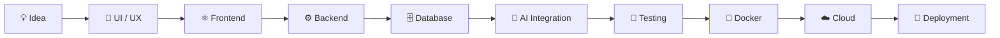

<div align="center">


<br/>


# Syed Gohar Hussain

### Full-Stack Developer · Mobile Developer · Applied AI Engineer

<p>
Building modern web applications, cross-platform mobile products, intelligent systems,
and scalable backend architectures.
</p>

<br/>

<a href="https://github.com/SyedGoharHussain">

</a>
&nbsp;
<a href="https://www.linkedin.com/in/syed-gohar-hussain-b165a4283/">

</a>
&nbsp;
<a href="mailto:syedgohar933036@gmail.com">

</a>

<br/><br/>


</div>

---

## ⚡ About Me

```python
class Gohar:

    role = "Full-Stack Developer | Mobile Developer | Applied AI Engineer"
    experience = "2+ Years"

    focus = [
        "Scalable Web Applications",
        "Cross-Platform Mobile Applications",
        "Applied Artificial Intelligence",
        "Computer Vision",
        "RAG & LLM Applications",
        "Cloud & Backend Architecture"
    ]

    engineering_principles = [
        "Clean & Maintainable Code",
        "Performance Optimization",
        "Scalable Architecture",
        "Automation",
        "Continuous Learning"
    ]

    philosophy = "Turn complex ideas into reliable digital products."
```

I am an **Information Technology professional and developer with 2+ years of hands-on experience** building full-stack applications, mobile products, intelligent systems, REST APIs, and cloud-based solutions.

My work spans the complete development lifecycle — from **UI/UX and application architecture to backend engineering, AI integration, testing, deployment, and cloud infrastructure**.

I particularly enjoy working at the intersection of **software engineering and artificial intelligence**, creating products that are not only functional but also scalable, maintainable, and production-ready.

---

# 🧠 Core Expertise

<div align="center">

|             Domain            | Expertise                                          |
| :---------------------------: | :------------------------------------------------- |
| 🌐 **Full-Stack Development** | React.js · Node.js · Flask · REST APIs             |
|   📱 **Mobile Development**   | Flutter · Dart · React Native                      |
|       🤖 **Applied AI**       | Machine Learning · Computer Vision · NLP           |
|      🧠 **Generative AI**     | RAG · LLM Integration · AI Applications            |
|    👁️ **Computer Vision**    | MediaPipe · OpenCV · Deep Learning                 |
|     ☁️ **Cloud & Backend**    | Firebase · Google Cloud · APIs · Real-Time Systems |
|         ⚙️ **DevOps**         | Git · Docker · Kubernetes · CI/CD                  |
|       🗄️ **Databases**       | Firebase · MySQL · MongoDB                         |

</div>

---

# 🛠️ Technology Arsenal

### Languages

<p>

</p>

### Frontend & Mobile

<p>

</p>

### Backend & APIs

<p>

</p>

### AI / Machine Learning

<p>

</p>

**AI & ML:**
`Machine Learning` · `Deep Learning` · `Computer Vision` · `NLP` · `RAG` · `LLMs` · `MediaPipe` · `OpenCV`

### Cloud, DevOps & Infrastructure

<p>

</p>

### Databases

<p>

</p>

---

# 🚀 What I Build

<div align="center">

```text
┌───────────────────────────────────────────────────────────┐
│                                                           │
│   WEB APPLICATIONS        MOBILE APPLICATIONS             │
│                                                           │
│   React / Flask            Flutter / React Native         │
│                                                           │
├───────────────────────────────────────────────────────────┤
│                                                           │
│   AI-POWERED PRODUCTS     REAL-TIME SYSTEMS               │
│                                                           │
│   CV / ML / RAG / LLM      WebSocket / WebRTC             │
│                                                           │
├───────────────────────────────────────────────────────────┤
│                                                           │
│   CLOUD ARCHITECTURE       BACKEND SERVICES                │
│                                                           │
│   GCP / Firebase / CI/CD   REST APIs / Authentication     │
│                                                           │
└───────────────────────────────────────────────────────────┘
```

</div>

---

# 🧩 Featured Projects

## 🏀 KOURT AI

**AI-Powered Basketball Coaching Platform**

`Flutter` `Python` `MediaPipe` `Computer Vision` `Deep Learning`

An intelligent basketball coaching application designed to analyze player technique through video and provide meaningful feedback.

### Highlights

* Computer vision-based technique analysis
* Custom deep learning models
* MediaPipe pose estimation
* Fine-tuned ResNet-50 architecture
* Self-collected and public datasets
* Video-based movement analysis
* AI-assisted coaching feedback

---

## 🔗 ServiceLink

**Cross-Platform Service Marketplace**

`Flutter` `Dart` `Firebase` `GetX`

A mobile platform connecting users with local service professionals through a complete service discovery and communication workflow.

### Highlights

* User authentication
* Service category filtering
* Professional discovery
* Ratings and reviews
* Real-time in-app chat
* Push notifications
* Worker dashboard
* Requests and earnings management
* Performance tracking

---

## 🎬 MoodFlix AI

**AI-Powered Movie Recommendation System**

`Flask` `React.js` `Computer Vision` `NLP`

An intelligent recommendation platform that combines facial analysis with scenario-based questions to understand user mood and recommend relevant movies.

### Highlights

* Facial expression analysis
* Mood detection
* Scenario-based interaction
* Intelligent recommendation engine
* React frontend
* Flask backend
* AI-driven user experience

---

## 💬 Anonymous Chat

**AI-Powered Real-Time Anonymous Chat**

`React.js` `Flask` `Firebase` `Docker` `Gemini API`

A full-stack anonymous communication platform with AI-powered streaming responses and modern backend controls.

### Highlights

* Real-time streaming responses
* Gemini API integration
* Authentication
* Rate limiting
* Flask REST backend
* React frontend
* Dockerized architecture
* Cloud deployment

---

# ☁️ Full Development Lifecycle

<div align="center">



</div>

---

# 🤖 AI & Intelligent Systems

My AI development interests and experience include:

<div align="center">

### 👁️ Computer Vision

`MediaPipe` · `OpenCV` · `Pose Estimation` · `Facial Analysis`

### 🧠 Machine Learning

`TensorFlow` · `PyTorch` · `Deep Learning` · `Model Fine-Tuning`

### 💬 Generative AI

`LLMs` · `RAG` · `Context-Aware Applications` · `AI APIs`

### 📝 NLP

`Natural Language Processing` · `Text Understanding` · `AI Recommendations`

</div>

---

# ⚙️ Engineering Approach

```text
        ┌───────────────────────┐
        │       Problem         │
        └───────────┬───────────┘
                    ↓
        ┌───────────────────────┐
        │   System Architecture │
        └───────────┬───────────┘
                    ↓
        ┌───────────────────────┐
        │     Development       │
        └───────────┬───────────┘
                    ↓
        ┌───────────────────────┐
        │    Testing & QA       │
        └───────────┬───────────┘
                    ↓
        ┌───────────────────────┐
        │   Cloud & Deployment  │
        └───────────┬───────────┘
                    ↓
        ┌───────────────────────┐
        │ Optimization & Scale  │
        └───────────────────────┘
```

I focus on building systems that are:

**Reliable · Maintainable · Scalable · Secure · Performant**

---

# 📈 GitHub Activity

<div align="center">


</div>

<br/>

<div align="center">


</div>

---

# 🏆 Achievements

<div align="center">

| 🏅 Achievement          |                    Result                    |
| :---------------------- | :------------------------------------------: |
| 🎓 Academic Achievement |               Highest Achiever               |
| 💻 CodeAir Competition  |          Top 20 / 600+ Participants          |
| 🏀 Leadership           | Captain — Air University HEC Basketball Team |
| 👥 Technical Leadership |     Development Team Lead — AUCIS Society    |

</div>

---

# 📚 Currently Exploring

```text
Advanced Data Structures
        ↓
Algorithms & Problem Solving
        ↓
System Design
        ↓
Distributed & Cloud Systems
        ↓
Advanced AI / LLM Applications
        ↓
Production-Grade AI Systems
```

I continuously explore new technologies with a focus on **strong engineering fundamentals, scalable architecture, artificial intelligence, and real-world product development**.

---

# 🎯 Development Philosophy

<div align="center">

### Build → Learn → Improve → Scale

> **"Good software solves a problem. Great software solves it reliably at scale."**

</div>

---

# 🤝 Let's Connect

<div align="center">

<a href="https://github.com/SyedGoharHussain">

</a>

<a href="https://www.linkedin.com/in/syed-gohar-hussain-b165a4283/">

</a>

<a href="mailto:syedgohar933036@gmail.com">

</a>

<br/><br/>

**Open to interesting engineering challenges, collaborations, and opportunities.**

<br/>


</div>
