```mermaid
graph LR
    A[Idea] -->|Architecture| B[UI/UX]
    B -->|Design| C[Frontend]
    C -->|Integration| D[Backend]
    D -->|Storage| E[Database]
    E -->|Intelligence| F[AI Integration]
    F -->|Quality| G[Testing]
    G -->|Launch| H[Deployment]
    H -->|Improve| I[Optimization]

    style A fill:#0F172A,stroke:#818CF8,stroke-width:1px,color:#fff
    style B fill:#1E1B4B,stroke:#818CF8,stroke-width:1px,color:#fff
    style C fill:#312E81,stroke:#818CF8,stroke-width:1px,color:#fff
    style D fill:#3730A3,stroke:#818CF8,stroke-width:1px,color:#fff
    style E fill:#4338CA,stroke:#818CF8,stroke-width:1px,color:#fff
    style F fill:#4F46E5,stroke:#818CF8,stroke-width:1px,color:#fff
    style G fill:#6366F1,stroke:#818CF8,stroke-width:1px,color:#fff
    style H fill:#7C3AED,stroke:#818CF8,stroke-width:1px,color:#fff
    style I fill:#8B5CF6,stroke:#818CF8,stroke-width:1px,color:#fff
```

<div align="center">


<a href="https://git.io/typing-svg">
  
</a>

</div>

---

<h2>&nbsp; About Me</h2>

<table align="center">
<tr>
<td width="60%">

```typescript
const gohar = {
  role: "Full-Stack & AI Engineer",
  experience: "2+ years",
  location: "Pakistan",
  education: "Information Technology",
  passions: [
    "Building scalable digital products",
    "AI-powered applications",
    "Clean architecture",
    "Performance optimization"
  ],
  currentlyLearning: "Advanced System Design"
};
```

</td>
<td width="40%" align="center">

</td>
</tr>
</table>

I am an Information Technology professional and developer with 2+ years of hands-on experience building full-stack applications, mobile products, intelligent systems, REST APIs, and cloud-based solutions.

My experience covers the complete software development lifecycle: UI/UX implementation, application architecture, frontend and mobile development, backend engineering, AI integration, database systems, testing, deployment, and cloud infrastructure.

I specialize in building reliable, scalable digital products while keeping code clean, maintainable, and performant.

---

<h2>&nbsp; Technical Skills</h2>

<details open>
<summary><b>Programming Languages</b></summary>
<br/>
<p align="center">


</p>
</details>

<details open>
<summary><b>Frontend Development</b></summary>
<br/>
<p align="center">


</p>
</details>

<details open>
<summary><b>Mobile Development</b></summary>
<br/>
<p align="center">


</p>
</details>

<details open>
<summary><b>Backend Development</b></summary>
<br/>
<p align="center">


</p>
</details>

<details open>
<summary><b>AI & Machine Learning</b></summary>
<br/>
<p align="center">


</p>
</details>

<details open>
<summary><b>Cloud & Infrastructure</b></summary>
<br/>
<p align="center">


</p>
</details>

<details open>
<summary><b>Databases</b></summary>
<br/>
<p align="center">


</p>
</details>

<details open>
<summary><b>Development Tools</b></summary>
<br/>
<p align="center">


</p>
</details>

---

<h2>&nbsp; Development Philosophy</h2>

<div align="center">
  
</div>

<h3 align="center">Development Capabilities</h3>



<div align="center">
<table>
<tr>
<td align="center">Reliable</td>
<td align="center">Maintainable</td>
<td align="center">Scalable</td>
<td align="center">Secure</td>
<td align="center">Performant</td>
<td align="center">Production-ready</td>
</tr>
</table>
</div>

---

<h2>&nbsp; Featured Projects</h2>

<table>
<tr>
<td width="50%" valign="top">

<h3 align="center"> KOURT AI</h3>
<p align="center">AI-Powered Basketball Coaching Platform</p>
<p align="center">


</p>

- Computer vision-based technique analysis
- Pose estimation using MediaPipe
- Custom deep learning models
- Fine-tuned ResNet-50 model
- AI-assisted coaching feedback

</td>
<td width="50%" valign="top">

<h3 align="center"> ServiceLink</h3>
<p align="center">Cross-Platform Service Marketplace</p>
<p align="center">


</p>

- User authentication & profiles
- Real-time in-app chat
- Push notifications
- Worker dashboard
- Earnings tracking

</td>
</tr>
<tr>
<td width="50%" valign="top">

<h3 align="center"> MoodFlix AI</h3>
<p align="center">AI-Powered Movie Recommendation System</p>
<p align="center">


</p>

- Facial expression analysis
- Mood detection
- Scenario-based questions
- Intelligent recommendations

</td>
<td width="50%" valign="top">

<h3 align="center"> Anonymous Chat</h3>
<p align="center">AI-Powered Real-Time Anonymous Chat</p>
<p align="center">


</p>

- Anonymous communication
- AI-powered responses
- Streaming AI responses
- Dockerized architecture

</td>
</tr>
</table>

---

<h2>&nbsp; GitHub Statistics</h2>

<div align="center">
  
  
</div>

<div align="center">
  
</div>

<div align="center">
  
</div>

> **Note on this section:** these cards are rendered by free third-party services (github-readme-stats, streak-stats). They occasionally go down or rate-limit, which is what caused the broken icons in your screenshot. I switched the streak card to a more stable mirror (`streak-stats.demolab.com`), but there's no permanent guarantee here — the only fully reliable fix is self-hosting the stats as static SVGs via a GitHub Action in your profile repo. Say the word if you want that set up.

---

<h2>&nbsp; Achievements</h2>

| Icon | Achievement | Description |
|:---:|---|---|
|  | Highest Academic Achiever | Highest achiever in the IT program |
|  | CodeAir Competition Finalist | Top 20 out of 600+ competitors |
|  | HEC Basketball Team Captain | Captain of Air University HEC Basketball Team |
|  | Development Team Leadership | Team Lead at Air University AUCIS Society |

---

<h2>&nbsp; Currently Exploring</h2>

<div align="center">
  
  
  
  
  
  <br/>
  
  
  
  
</div>

---

<div align="center">

**Build → Learn → Improve → Scale**

*"Good software solves a problem. Great software solves it reliably at scale."*

</div>

---

<h2>&nbsp; Let's Connect</h2>

<div align="center">

I am open to interesting engineering challenges, technical collaborations, and opportunities to build innovative digital products.

<a href="https://github.com/SyedGoharHussain" target="_blank">
  
</a>
<a href="https://linkedin.com/in/syed-gohar-hussain" target="_blank">
  
</a>
<a href="mailto:syedgohar933036@gmail.com">
  
</a>
<a href="https://syedgoharhussain.github.io" target="_blank">
  
</a>

<br/><br/>


</div>

<div align="center">

</div>
